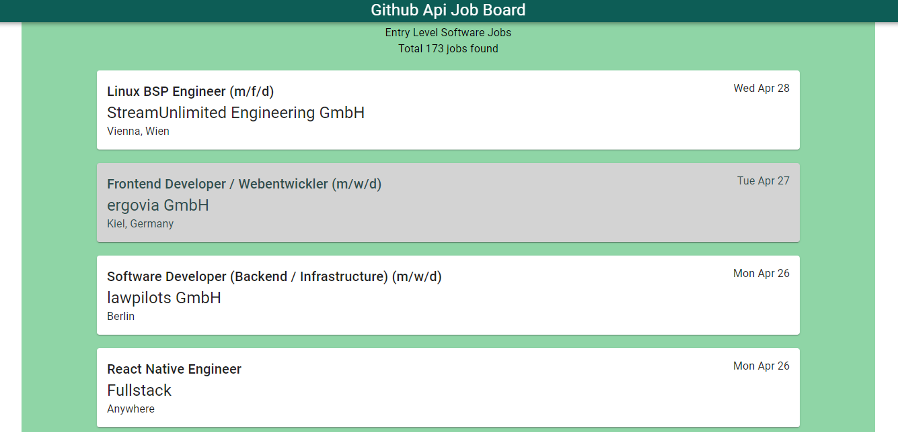
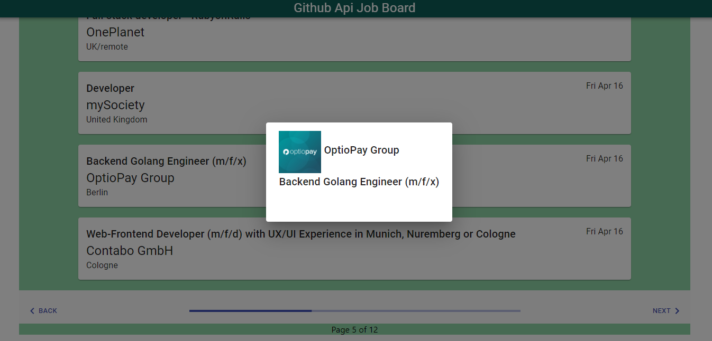

# JobListingAPP
This is a Job Listing Web Application powered with React and NodeJS and Redis. Jobs are coming from github api. can be modified easly to use other Api. The UI is designed with material UI for react. single job description is diplayed in modal and job lists are displayed with pagination. Application has three parts

- Front End
- Back End (Api)
- Cron Job runner (saves the data to redis)

## Screens

